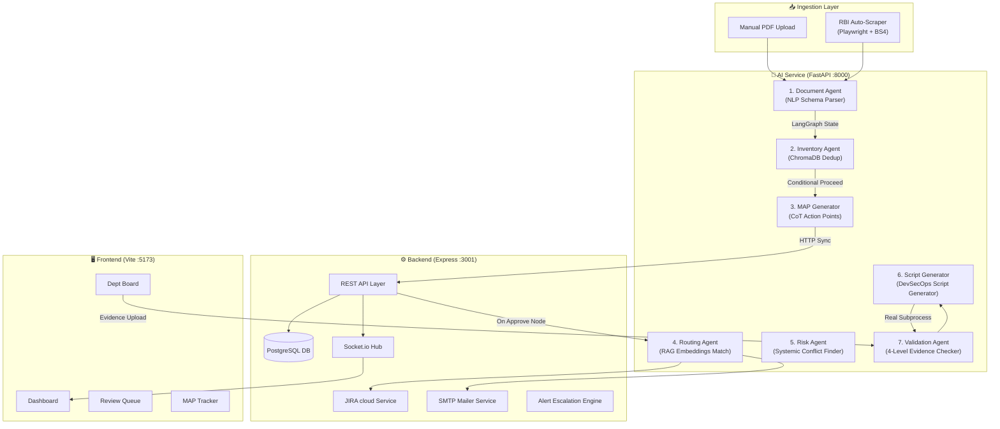

# ARCA: Autonomous Regulatory Compliance Agent for Banking

### 🧠 Multi-Agent Stateful Orchestration • RAG Routing • Real-World Subprocess Sandbox • Canara Bank Edition
**Developed for the SuRaksha Cyber Hackathon by Canara Bank**

---

## 📌 Table of Contents
1. [Executive Summary & The Compliance Problem](#1-executive-summary--the-compliance-problem)
2. [Key Core Features](#2-key-core-features)
3. [System Architecture & Visual Flows](#3-system-architecture--visual-flows)
4. [The 7 Cooperative Compliance Agents](#4-the-7-cooperative-compliance-agents)
5. [Project Directory Structure](#5-project-directory-structure)
6. [Local Quick-Start Guide (Host Execution)](#6-local-quick-start-guide-host-execution)
7. [Docker Multi-Container Stack Deployment](#7-docker-multi-container-stack-deployment)
8. [API Reference Contract & Endpoints](#8-api-reference-contract--endpoints)
9. [Immutable Audit Trails & WebSockets Stream](#9-immutable-audit-trails--websockets-stream)
10. [Corporate Light-Themed Banking Dashboard UI/UX](#10-corporate-light-themed-banking-dashboard-uiux)
11. [Security Posture & Safety Mandates](#11-security-posture--safety-mandates)
12. [RegTech Startup Evolution Roadmap](#12-regtech-startup-evolution-roadmap)

---

## 1. Executive Summary & The Compliance Problem

In the modern banking industry, regulatory compliance represents a **₹2,000 to ₹5,000 crore operational bottleneck in India alone**. Regulatory bodies like the **Reserve Bank of India (RBI)**, **SEBI**, **CERT-In**, and **FIU-IND** release thousands of dense, legalistic, multi-page circular directives, notifications, and master updates annually. 

### The Problem
Traditional compliance tracking in major banks is **highly manual and error-prone**:
* **Cognitive Overload:** Compliance teams must read hundreds of pages of legal text to identify precise actionable obligations.
* **Interpretation Gaps:** Manual translation of dense legal prose into operational guidelines causes critical interpretation mismatches.
* **Tracking & Deadline Slippage:** Dispersed tasks across email chains and manual spreadsheets lead to delayed closures and massive regulatory fines.
* **Verification Mismatches:** Fulfilling a task is often reduced to a verbal/written "Done" confirmation rather than rigorous, programmatic validation.

### The Solution: ARCA
**ARCA** (Autonomous Regulatory Compliance Agent) is a state-of-the-art RegTech platform that automates the **entire compliance lifecycle**—from raw circular ingestion to action item extraction, department-wide routing, SMTP/JIRA task dispatch, evidence collection, and **real-world, autonomous technical code execution sandboxing** to dynamically audit and verify compliance proof.

> 📖 **Read the Full Product Vision & Scope:** [ARCA_Product_Vision_And_Scope.md](docs/ARCA_Product_Vision_And_Scope.md) 
> ARCA functions as an intelligent compliance operations platform that transforms regulatory circulars into measurable, trackable, and verifiable compliance actions across the bank. It explicitly filters out non-relevant entities (like standalone NBFCs and UCBs) and routes tasks to 13 distinct banking business functions.

---

## 2. Key Core Features

* **🧠 Stateful 7-Agent LangGraph Pipeline:** Orchestrates 7 cooperative, specialized AI agents inside a directed acyclic graph (DAG) utilizing stateful context passing and conditional branch routing.
* **📂 Automated Document Parsing (NLP + OCR):** Fast digital extraction utilizing PyMuPDF and automatic fallback to PyTesseract OCR engines to handle scanned regulatory documents.
* **🔍 Semantic ChromaDB Routing (RAG):** RAG-based cosine similarity mapping comparing compliance action items against 13 separate bank department knowledge profiles, double-verified by LLM validation.
* **💻 Real Python Subprocess Execution Sandbox:** Dynamically generates and executes isolated, read-only Python scripts in background subprocess threads to technically inspect, audit, and verify system configurations (SSL setups, MFA gateway APIs, port settings, log retentions) against submitted evidence.
* **🔌 Enterprise integrations (JIRA + SMTP):** Automatically generates and synchronizes JIRA tickets for technical deliverables, and dispatches detailed HTML alert directives to department operators.
* **🔔 Live Event WebSocket Stream:** Live push-based logs stream WebSocket updates (using Socket.io) directly to the executive compliance sidebar terminal widget.
* **🏢 Shared PrismaClient Singleton Architecture:** Zero connection leaks. Employs a shared Prisma connection module to protect against connection exhaustion under peak ingestion load.
* **🛡️ Express API Hardening:** Built-in API rate limiting (300 requests / 15 minutes) and a structured JSON global error handler capturing timestamp, codes, tracking paths, and stack traces.

---

## 3. System Architecture & Visual Flows

ARCA consists of three independent microservices that communicate over structured HTTP REST interfaces and event-driven Socket.io WebSockets:



### LangGraph Ingestion Pipeline Flow
Every uploaded circular PDF triggers a stateful directed execution path:

```
[Upload PDF] ➔ Document Parser ➔ ChromaDB Dedup Check
                                         │
                        ┌────────────────┴────────────────┐
                 [DUPLICATE]                               [PROCEED]
                        ▼                                 ▼
                     [END] ➔ Discard               MAP Generation (CoT)
                                                          │
                                                    Save to Database
                                                          │
                                                    RAG Dept Routing
                                                          │
                                                    Conflict & Risk Audit
                                                          │
                                                    Script Generation
                                                          │
                                                        [END]
```

---

## 4. The 7 Cooperative Compliance Agents

ARCA coordinates 7 highly specialized compliance agents, each written in Python with detailed prompt engineering:

### 1. Document Agent (`document_agent.py`)
Parses raw regulatory text into a structured JSON schema. Extracts metadata, publication date, primary authority, specific provisions, section references, penalty criteria, and detects if the document is an amendment to an older directive. Pre-seeded with robust mock structures for KYC/AML, CERT-In, and NBFC guidelines.

### 2. Inventory Agent (`inventory_agent.py`)
Queries ChromaDB to perform semantic duplicate detection. If the document content or provisions show a cosine similarity score of `>= 0.98` against active regulations, it short-circuits the pipeline (`DUPLICATE ➔ END`). If it is a new directive, it proceeds. If it is an amendment, it identifies the affected prior compliance items.

### 3. MAP Generator Agent (`map_generation_agent.py`)
Employs Chain-of-Thought (CoT) reasoning to translate provisions into granular, actionable **Measurable Action Points (MAPs)**. Calculates high-integrity compliance deadlines, priority scores, and required evidence checklists (e.g. log configuration file, system screenshot, policy document).

### 4. Routing Agent (`routing_agent.py`)
Performs semantic vector RAG matching by embedding generated MAP keywords and descriptions, comparing them against the embedded profiles of 13 separate banking departments in ChromaDB. Verifies the result using a secondary LLM confirmation loop, outputting `department`, `confidence`, and a detailed `justification`.

### 5. Risk Agent (`risk_agent.py`)
Examines all active MAP tasks to detect systemic conflicts, timing dependencies, and organizational constraints. Generates a risk profile and highlights regulatory friction points (e.g., biometric authentication delays conflicting with rapid onboarding guidelines).

### 6. Script Generator (`script_generator.py`)
Generates structured, **read-only Python validation scripts** for compliance actions classified as `TECHNICAL` (e.g., testing SSL cipher suites, API token headers, local firewall configurations). The generated scripts comply with strict security boundaries and output structured JSON.

### 7. Validation Agent (`validation_agent.py`)
Orchestrates a **4-Level evidence auditing pipeline**:
* **Level 1 (Completeness):** Confirms required evidence files are present.
* **Level 2 (Relevance):** Assesses uploaded file extensions (PNG, JPG, PDF, JSON, LOG).
* **Level 3 (Requirement Match):** Analyzes uploaded text and logs against deliverables checklist using keyword extraction and semantic evaluations.
* **Level 4 (Technical Run):** Spawns an asynchronous host thread to run the AI-generated read-only inspection script, capturing exit codes and JSON compliance logs.

---

## 5. Project Directory Structure

ARCA is structured into three dedicated microservice folders, making development and deployment exceptionally clean:

```
ARCA/
├── arca_ai_service/             # FastAPI AI & Agentic Orchestration Service (Python)
│   ├── app/
│   │   ├── api/                 # FastAPI router endpoints (pipeline, scraper, validation)
│   │   ├── agents/              # The 7 agent logic engines (document, inventory, risk, etc.)
│   │   ├── core/                # Configuration and environment setup
│   │   ├── pipelines/           # Stateful LangGraph pipeline orchestrator
│   │   ├── prompts/             # System instructions & CoT instructions
│   │   ├── services/            # pdf_processor, BeautifulSoup/Playwright scrapers
│   │   └── vectorstore/         # ChromaDB client & collections seeding
│   ├── data/
│   │   └── chroma_db/           # Persistent local vector store volume
│   ├── main.py                  # AI service entrypoint
│   └── requirements.txt         # Python package dependencies
│
├── arca_backend/                # Node.js + Express API Gateway Service
│   ├── prisma/
│   │   ├── schema.prisma        # PostgreSQL entity-relationship definitions
│   │   └── seed.js              # Database department seeding script
│   ├── src/
│   │   ├── config/              # Shared PrismaClient singleton instance config
│   │   ├── controllers/         # alert, dispatch, document, and map controllers
│   │   ├── middleware/          # Rate limiter, express static configurations
│   │   └── routes/              # Express REST routing layers
│   ├── server.js                # Server entrypoint with Socket.io hub configuration
│   └── package.json             # Backend dependencies list
│
├── arca_frontend/               # React Dashboard Portal UI
│   ├── src/
│   │   ├── App.tsx              # Componentized Tab dashboards, modals, & WebSocket logs
│   │   ├── App.css              # Custom Light-themed bank portal CSS design tokens
│   │   └── main.tsx             # React SPA bootstrap
│   └── package.json             # Frontend bundle configurations
│
└── docker/                      # Multi-Container Orchestration
    ├── ai.Dockerfile            # Multi-stage Python 3.11 with tesseract and poppler
    ├── backend.Dockerfile       # Node 20 environment with Prisma generation steps
    ├── frontend.Dockerfile      # Lightweight Node environment serving Vite
    └── docker-compose.yml       # 5-service orchestration (Postgres, Redis, Backend, AI, UI)
```

---

## 6. Local Quick-Start Guide (Host Execution)

Follow these steps to spin up the entire ARCA environment locally on your host machine.

### Prerequisites
* **Node.js:** v18.0.0 or higher
* **Python:** v3.10.0 or higher (Miniconda/Conda recommended)
* **PostgreSQL:** Running locally or in Docker
* **Redis:** Running locally or in Docker

---

### Step 1: Spin up Postgres and Redis Databases
ARCA provides a lightweight docker configuration to boot up the core databases immediately. Run this command from the project root:
```bash
docker run -d --name arca_postgres -p 5543:5432 -e POSTGRES_USER=arca_user -e POSTGRES_PASSWORD=arca_pass -e POSTGRES_DB=arca postgres:15-alpine
docker run -d --name arca_redis -p 6380:6379 redis:7-alpine
```

---

### Step 2: Configure and Boot the Express Backend
1. Navigate to the backend directory:
   ```bash
   cd arca_backend
   ```
2. Install dependencies (including rate-limiters):
   ```bash
   npm install
   ```
3. Sync and seed the database schema:
   ```bash
   npx prisma db push
   node prisma/seed.js
   ```
4. Start the backend developer API server:
   ```bash
   npm run dev
   ```
   *The Express backend is now live at **http://localhost:3001***.

---

### Step 3: Install and Boot the FastAPI AI Service
1. Open a new terminal window and navigate to the AI service directory:
   ```bash
   cd arca_ai_service
   ```
2. Create and activate a conda/python environment, then install dependencies:
   ```bash
   pip install -r requirements.txt
   pip install python-multipart
   ```
3. Start the FastAPI server using Uvicorn:
   ```bash
   python main.py
   ```
   *The FastAPI AI Service is now live at **http://localhost:8000***.

---

### Step 4: Boot the Vite React Frontend
1. Open a third terminal window and navigate to the frontend directory:
   ```bash
   cd arca_frontend
   ```
2. Install package bundles:
   ```bash
   npm install
   ```
3. Start the developer server:
   ```bash
   npm run dev
   ```
   *The React interface console is now live at **http://localhost:5173/***!

---

## 7. Docker Multi-Container Stack Deployment

ARCA can be launched as a fully orchestrated, production-ready stack in a single command. 

Navigate to the `docker` directory and run:
```bash
cd docker
docker-compose up --build -d
```

This spins up all 5 isolated services:
1. `arca_postgres` on port `5543` with database health verification checking.
2. `arca_redis` on port `6380`.
3. `arca_backend` on port `3001`,Cascading initialization only after the Postgres database is fully healthy.
4. `arca_ai_service` on port `8000`.
5. `arca_frontend` on port `5173` (vite developer host exposed).

---

## 8. API Reference Contract & Endpoints

### ⚙️ Backend REST API Gateway (`:3001`)

* `GET /api/maps`: Fetches all generated MAP items (supports pagination and priority filtering).
* `GET /api/maps/pending-review`: Fetches all items awaiting compliance officer review gate clearance.
* `PUT /api/maps/:id/approve`: Approves a generated MAP and dispatches email & JIRA synchronization tickets.
* `PUT /api/maps/:id/edit`: Allows parameter calibration (adjust deadlines, priorities, reroute department).
* `POST /api/maps/:id/evidence`: Receives file upload proof via `multer` and triggers autonomous Level 1-4 validation.
* `POST /api/maps/:id/override`: Authorizes compliance officer override validation verdicts with mandatory reasoning logs.
* `GET /api/risk/dashboard`: Aggregates active statistics, alert counts, and compiles the overall banking compliance index score.
* `POST /api/alerts/scan`: Triggers cron-checks on approaching deadlines.

### 🧠 FastAPI AI Services (`:8000`)

* `POST /api/pipeline/run`: Executed by backend circular upload. Takes circular text and runs the stateful 7-agent LangGraph workflow.
* `GET /api/scraper/status`: Returns Playwright BeautifulSoup RBI crawling metrics.
* `POST /api/scraper/trigger`: Runs background Playwright scraper tasks to parse RBI compliance websites.

---

## 9. Immutable Audit Trails & WebSockets Stream

Compliance requires absolute traceability. ARCA captures this at two levels:

### 1. The Real-Time WebSocket Event Stream
The React Sidebar is wired to a Socket.io event loop. As the backend and python agents execute complex pipelines, events are pushed live:
* `map:new`: Fired when the MAP agent creates operational directives.
* `map:approved`: Triggered when an officer triages a guideline.
* `evidence:submitted`: Fired when a banking department uploads file proof.
* `validation:complete`: Triggered when the Level 4 Python sandbox runner yields a verdict.
* **UI Stream:** These are compiled chronologically in a monospace terminal block directly in the dashboard sidebar.

### 2. The Database Audit Log Model
Every mutation (Upload, Review, Approve, Script Run, Override) writes an immutable transaction log to the `AuditLog` database entity, capturing the actor ("System:Agent" vs "Officer:John"), timestamp, event category, and detailed JSON metadata for forensics.

---

## 10. Corporate Light-Themed Banking Dashboard UI/UX

ARCA has been redesigned to reflect a premium, **clean light-themed bank portal**, avoiding typical sci-fi dark modes to ensure executive readability and clean corporate styling:

* **Executive Dashboard:** Presents clean KPI metrics, an animated, border-separated circular compliance posture progress SVG ring, color-coded department risk bar indicators, and a clean chronological audit stream log.
* **Review Gate:** Displays triage items in structured light tabular grids with bulk-selection triggers and explicit triage actions.
* **Kanban Division Portal:** Features a dropshadowed selector to choose bank divisions (e.g. IT Security, Core Banking, HR). Generates a clean 4-column layout (Dispatched, Under AI Audit, Failed, Passed) with styled warning frames and inline evidence submit triggers.

---

## 11. Security Posture & Safety Mandates

When running dynamic, AI-generated Python scripts to inspect host environments, security is the primary mandate. ARCA enforces this through structural design:

1. **Read-Only Constraints:** The script generator agent's system prompt explicitly restricts code generation to non-mutating, read-only system audits (e.g., inspecting port settings, SSL certificate expiration, config headers). No write, drop, delete, or network outbound commands are permitted.
2. **Execution Timeout:** Subprocesses are locked to a strict 30-second execution window. Timeout exceptions are captured, terminating the process and logging a `FAIL` audit status.
3. **Suppressed Compilation:** Bytecode generation is suppressed via environmental flags (`PYTHONDONTWRITEBYTECODE=1`) to prevent lingering cache footprints.

---

## 12. RegTech Startup Evolution Roadmap

If evolving ARCA from a hackathon prototype into a enterprise SaaS compliance product, these are the technical milestones:

### Phase 1: Security & Sandboxing
- Migrate the local python subprocess runner to a microVM sandbox environment (e.g. `gVisor` or AWS `Firecracker`) to achieve kernel-level host isolation during validation script execution.
- Implement Role-Based Access Control (RBAC) utilizing JWT SSO credentials integrated with Active Directory.

### Phase 2: Vector Scaling & Scraper Resiliency
- Swap ChromaDB with a production-grade vector database (e.g., Qdrant/Weaviate) supporting full multi-tenant index separation.
- Upgrade Playwright BeautifulSoup scrapers with automatic visual solvers to parse ASP.NET viewstates on government regulatory indices.

### Phase 3: Fine-Tuning & Knowledge Graph
- Train a regulatory-focused adapter model on historical Indian banking circulars to optimize action point parsing precision.
- Build a Neo4j Knowledge Graph connecting circulars, provisions, departments, and compliance deadlines to visualize institutional risk relationships.
