# ARCA: Developer System Audit, Architecture & Task Tracker

This document serves as the comprehensive developer audit, architectural summary, and task tracker for **ARCA (Autonomous Regulatory Compliance Agent)**. It details what has been completed, what is pending, the technical layout, system fixes, and comparisons between the initial implementation plans and the active codebase.

---

## 1. System Architecture & High-Level Data Flow

ARCA is built as a three-tier decoupled architecture to separate AI reasoning, transactional data storage, and the executive visualization interface:

```mermaid
graph TD
    %% Ingestion Sources
    A[Manual PDF Upload] -->|Raw Text & Metadata| B[FastAPI AI Service:8000]
    A2[Playwright Web Scraper] -->|Automated Circulars| B
    
    %% AI Pipeline
    subgraph FastAPI AI Service [AI Core Services]
        B -->|1. Ingest/Extract| C[Document Agent]
        C -->|2. Inventory Check| D[Inventory Agent RAG]
        D -->|3. CoT Provisions Mapping| E[MAP Generator Agent]
        E -->|4. Structural Analysis| F[Risk Agent]
        F -->|5. Generate Audit Script| G[Script Generator Agent]
        style FastAPI AI Service fill:#0b1329,stroke:#3b82f6,stroke-width:2px
    end
    
    %% Sync & Routing
    G -->|6. Sync Structured MAPs| H[Node.js Express Backend:3001]
    
    %% Backend Services
    subgraph Express Backend [Operational Core]
        H -->|Prisma ORM| I[(PostgreSQL DB)]
        H -->|Dispatch Event| J[Routing Agent]
        J -->|Acknowledge & Sync| K[Jira Gateway Mock/Real]
        J -->|Assignment Memo| L[SMTP Email dispatch]
        style Express Backend fill:#0d2818,stroke:#10b981,stroke-width:2px
    end

    %% Evidence Validation Loops
    M[Vite React Frontend:5173] -->|Department Submits Evidence| H
    H -->|Auto-Trigger Validation| N[Validation Agent]
    N -->|Execute Test Script| O[Sandboxed Python Script]
    O -->|Validation Result| N
    N -->|Update Verdict & Posture| H
    
    %% Real-time updates
    H -->|Socket.io Live Events| M
```

### Decoupled Service Ports Configuration:
*   **FastAPI AI Service:** Runs at `http://127.0.0.1:8000` (Uvicorn).
*   **Express Backend Server:** Runs at `http://127.0.0.1:3001` (Nodemon).
*   **Vite React Frontend:** Runs at `http://localhost:5173` (Vite Dev Server).
*   **PostgreSQL Port Mapping:** Local host port `5543` maps to Postgres docker port `5432`.
*   **Redis Port Mapping:** Local host port `6380` maps to Redis docker port `6379`.

---

## 2. Completed Implementation (What We Done Yet)

### A. FastAPI AI Service (`arca_ai_service/`)
We have designed and fully coded a network of specialized, self-contained AI agents:
1.  **Document Agent (`document_agent.py`):** Parses raw text from PyMuPDF streams, identifies circular dates, categories, titles, and extracts raw compliance clauses. Incorporates a resilient regex-based fallback parser.
2.  **Inventory Agent (`inventory_agent.py`):** Performs vector similarity lookups in ChromaDB (`regulations_db` collection) to determine if a newly ingested document is a **new directive**, an **amendment**, or a **superseding notification** of previous circulars.
3.  **MAP Generator Agent (`map_generation_agent.py`):** Utilizes Chain-of-Thought (CoT) reasoning to translate raw provisions into granular, actionable, and testable tasks with defined deadlines, priorities, deliverables, and evidence checklists.
4.  **Risk Agent (`risk_agent.py`):** Scans generated action maps to detect timing dependencies (e.g., preventing IT execution before a Legal Policy check) and bottleneck warning flags.
5.  **Script Generator (`script_generator.py`):** Automatically creates read-only verification scripts (Python-based) customized for technical deliverables (e.g., verifying SSL/TLS version responses, certificate validity, ports, or directory permissions).
6.  **Validation Agent (`validation_agent.py`):** Coordinates a 4-level audit when departments submit evidence:
    *   *Level 1:* Checks presence and completeness of files.
    *   *Level 2:* Performs NLP keyword checks to map relevance.
    *   *Level 3:* LLM reasoning assessment comparing notes against the deliverables checklist.
    *   *Level 4:* Runs the generated validation script in a simulated environment to produce test metrics.
7.  **Playwright/BeautifulSoup Scraper (`rbi_scraper.py`):** Configured automated crawl threads to scrape regulatory index pages and download circular PDFs automatically.

### B. Express Backend (`arca_backend/`)
1.  **Database Seeding:** Created [seed_departments.js](file:///c:/Users/sharm/Desktop/cyber/ARCA/arca_backend/scripts/seed_departments.js) seeding 13 standard banking departments (IT Security, Treasury, Risk Management, Digital Banking, Compliance, etc.) with functional group emails.
2.  **Prisma Models:** Structured Prisma models mapped to PostgreSQL for `Document`, `Map`, `Department`, `Evidence`, `AuditLog`, and `Alert` records.
3.  **Audit Logs:** Configured unified controllers tracking event records (e.g., `DOCUMENT_INGESTED`, `MAP_APPROVED`, `EVIDENCE_SUBMITTED`, `VALIDATION_COMPLETE`) to populate the dashboard log streams.
4.  **SMTP Email Service:** Coded [emailService.js](file:///c:/Users/sharm/Desktop/cyber/ARCA/arca_backend/src/services/emailService.js) sending responsive HTML notification templates to departments.
5.  **Jira Synchronizer:** Built [jiraService.js](file:///c:/Users/sharm/Desktop/cyber/ARCA/arca_backend/src/services/jiraService.js) to automate issue ticket generation for technical compliance items under CISO projects (`ITSEC`, `DIGIIT`, `CBSIT`), incorporating graceful sandbox mocks when credentials are not supplied.

### C. Vite React Frontend (`arca_frontend/`)
1.  **Executive Dashboard:** Glassmorphic dashboard rendering global compliance posture score, active warning counts, dynamic department breakdowns, and live socket log streams.
2.  **Officer Review Gate:** Triage panel allowing compliance officers to inspect, edit parameters (titles, descriptions, deliverables, deadlines, target departments), approve, reject, or perform bulk approvals.
3.  **Department Operations Portal:** Interactive Kanban board tracking department obligations through four stages (`DISPATCHED`, `VALIDATION_FAILED`, `PENDING_VALIDATION`, `PASSED`). Contains evidence upload forms.
4.  **Ingestion Hub:** Dashboard area managing manual PDF uploads and automated scrapers controls.

---

## 3. Critical System Bug Fixes & Adjustments

During recent local integration tests on Windows, we encountered and fixed several layout, networking, and server-crashing bugs:

| Bug Detected | Root Cause | Resolution | Impact |
| :--- | :--- | :--- | :--- |
| **Axios Connection Network Error** | Windows DNS resolves `localhost` to IPv6 `::1`, while API servers bound to IPv4 `127.0.0.1`. | Switched API base paths in `App.tsx` from `localhost` to `127.0.0.1`. | Restored frontend-to-backend communication. |
| **`TypeError: Cannot read... (reading 'to')`** | Express routes were loaded in `app.js` before `req.io` middleware was injected in `server.js`. | Set `app.set('io', io)` in `server.js` and registered the request socket injector at the top of the middleware stack in `app.js`. | Stopped Node.js backend crash on document ingestion/sync. |
| **CORS/CORP Policy Blocks** | Helmet defaults blocked Cross-Origin Resource Policy requests from different ports. | Relaxed Helmet rules in `app.js` using `crossOriginResourcePolicy: false` and `crossOriginEmbedderPolicy: false`. | Enabled Vite portal at `5173` to safely read responses from API port `3001`. |
| **Half-Screen Dashboard Layout** | Root `#root` selector in global `index.css` had a hardcoded `width: 1126px` and centered margins. | Removed width caps on `#root` in `index.css`, replacing it with a fluid `width: 100%` widescreen container. | Restored full widescreen responsive layout. |
| **Flex Contents Cut-off** | Flexbox children containing wide grids or tables expanded beyond parent bounds. | Added `min-width: 0;` to `.main-content` in `App.css`. | Prevented horizontal grid overflow; all metrics cards are visible. |

---

## 4. Initial Implementation Plan vs. Current Codebase

Several architectural adjustments were implemented to ensure the application remains functional, resilient, and demo-ready:

1.  **API Key Resilience (Emulated Tool Calls):** 
    *   *Plan:* Expected standard LangChain `with_structured_output` JSON parameters to map OpenAI tool models directly.
    *   *Current Code:* Groq's tool emulation on `llama-3.3-70b-versatile` frequently crashed standard structured parsers. We implemented a dynamic `try/catch` fallback in agents. If structured output fails, the agent queries the LLM via raw invocation, explicitly requesting `response_format={"type": "json_object"}` and parsing it via a resilient regex-based fallback logic.
2.  **Duplicate Hash Collision Safety:**
    *   *Plan:* Scrapers calculated SHA-256 hashes of text only.
    *   *Current Code:* Identical mock uploads produced duplicate source hashes, throwing Prisma 409 DB collisions. We updated the document fallbacks to append an MD5 hash of the unique file text to prevent duplicate key conflicts.
3.  **JIRA Gateway Fallback:**
    *   *Plan:* Integrate standard Axios calls directly to the enterprise JIRA cloud endpoint.
    *   *Current Code:* Added dynamic mock checks. If `JIRA_API_TOKEN` matches the hackathon placeholder or Jira base URL is mock, it generates synthetic Jira issue IDs (e.g. `ITSEC-8212`) and logs them. If it's a real endpoint but the connection fails, it catches the error and issues a graceful `ITSEC-FALLBACK-1902` key, ensuring the dispatcher never crashes the app.

---

## 5. Completed vs. Pending Tasks

Below is the structured, phase-by-phase tracker outlining what is fully operational and what represents future roadmap iterations:

### Phase 0: Foundations & Environments
- `[x]` Initialize decoupled projects (`arca_backend`, `arca_ai_service`, `arca_frontend`).
- `[x]` Map local container ports (`5543` for Postgres, `6380` for Redis) to avoid host allocation conflicts.
- `[x]` Standardize dependencies in `package.json` and python `requirements.txt`.
- `[x]` Configure active environment files (`.env`) for backend and AI service.
- `[x]` Commit `.gitignore` rules preventing secrets from leaking to public repos.

### Phase 1: Ingestion & Document Processing
- `[x]` Create PostgreSQL migrations and seed 13 banking departments.
- `[x]` Implement document manual upload routes with Multer.
- `[x]` Build FastAPI digital text extraction using PyMuPDF.
- `[x]` Build Document Agent metadata extraction with resilient JSON regex fallbacks.
- `[x]` Implement ChromaDB collection checking for overlapping previous directions.

### Phase 2: MAP Generation & Review Queue
- `[x]` Code Chain-of-Thought (CoT) mapping logic generating actionable tasks, priority rankings, and deliverable checklists.
- `[x]` Develop "Officer Review Queue" tab in React.
- `[x]` Implement endpoints for parameter edits, approvals, rejections, and bulk staging dispatches.
- `[x]` Implement backend database creation for generated MAPs.

### Phase 3: Routing, Notifications & JIRA Sync
- `[x]` Write HTML assignment templates in backend email service.
- `[x]` Implement JIRA issue ticket creation for IT-related technical assignments.
- `[x]` Code fallback handling for offline/mock ticketing and email triggers.
- `[x]` **[NEW IMPROVEMENT]** Implement **Dispatch Tracker** tab in React showing email logs, Jira keys, and department progress.

### Phase 4: Evidence Submission & Validation
- `[x]` Build department upload endpoint accepting up to 10 screenshots or logs.
- `[x]` Implement Async AI validation triggers comparing deliverables using LLM.
- `[x]` Implement automated Python script generator for technical deliverables validation.
- `[x]` Build manual officer override panel with mandatory audit-justification logs.
- `[/]` *Roadmap/Future:* Run generated scripts in network-isolated Docker sandbox containers (currently run in simulated dry-run mock mode to protect local system parameters).

### Phase 5: Live Posture & Alerting
- `[x]` Code compliance index grading calculation inside Express.
- `[x]` Setup socket rooms streaming live logs from backend to frontend terminal console.
- `[x]` Implement cron alerting service scanning deadlines and generating warnings.
- `[/]` *Roadmap/Future:* Integrate external SMS routing gateways to message department heads directly (currently mock-logged).
