# ARCA: Developer System Audit, Architecture & Task Tracker

This document serves as the comprehensive, hyper-detailed developer handbook, system audit, architectural blueprint, and task tracker for **ARCA (Autonomous Regulatory Compliance Agent)**. It outlines the banking regulatory landscape, system services config, class-level agent definitions, vector database schemas, automated testing levels, JIRA/SMTP configuration, and a file-by-file status checklist.

---

## 1. Banking Regulatory Ecosystem & Business Impetus

ARCA is specifically designed to handle the complex, multi-layered regulatory demands of the Indian banking sector. Operating a public-sector bank like **Canara Bank** requires tracking directives from several national and international entities:

### A. Target Indian Regulatory Bodies
1. **Reserve Bank of India (RBI):** The primary monetary authority. Issues Master Directions, circulars, and notifications governing core operations (capital adequacy, NPA classifications, Digital Lending Guidelines, KYC, KYC biometrics updates, interest rate disclosures). RBI publishes 200–400 circulars annually, which require rapid ingestion and interpretation to prevent massive penal fines (ranging from ₹1 crore to ₹30 crore).
2. **Securities and Exchange Board of India (SEBI):** Regulates capital markets, mutual fund distributions (bancassurance), and risk reporting frameworks.
3. **Indian Computer Emergency Response Team (CERT-In):** Mandates cybersecurity controls. Under April 2022 guidelines, banks must report cyber security incidents within **6 hours** of detection, necessitating instant circular-to-action routing.
4. **Financial Intelligence Unit - India (FIU-IND):** Receives Suspicious Transaction Reports (STRs) and Cash Transaction Reports (CTRs) to combat money laundering and terrorist financing.
5. **National Payments Corporation of India (NPCI):** Governs UPI protocols, NACH clearing operations, and card payment standards.
6. **Ministry of Finance (MoF):** Coordinates PSU directives and public financial schemes.
7. **Insurance Regulatory and Development Authority of India (IRDAI):** Sets compliance rules for insurance products sold through branch channels.

### B. Core Compliance Failures Solved by ARCA
* **Interpretation Latency:** Regulatory notifications average 5–50 pages of dense legal terminology. Manual assessment takes hours, creating bottlenecks.
* **Communication Silos:** Instructions passed via corporate email chains lack formal tracking, leading to deadline slippage.
* **Audit Scrambling:** Prior to RBI inspection, compliance officers manually compile evidence from spreadsheets and emails.
* **SWIFT-Core Disconnect:** Compliance failures (such as the PNB SWIFT incident of 2018) occur when external network actions are not audited.
* **The Yes Bank Example (2020):** Highlighted the critical risk of internal compliance gaps and inadequate reporting at the board level.

---

## 2. Seeded Banking Departments Matrix

The ARCA backend seeds **13 standard banking departments** within the database (via [seed_departments.js](../arca_backend/scripts/seed_departments.js)). Each department is assigned a dedicated compliance queue and group email mailbox:

| Seeded Department Name | Target Group Email | Core Operational Compliance Scope |
| :--- | :--- | :--- |
| **IT Security** | `it-security@canarabank.com` | Firewall audits, penetration testing, vulnerability patch updates, endpoint protections, cryptographic controls, CERT-In reporting. |
| **Digital Banking IT** | `digital-it@canarabank.com` | Customer-facing mobile banking (Canara AI1 app), NetBanking portals, UPI payment gateways, API integrations. |
| **Core Banking IT** | `cbs-it@canarabank.com` | Core ledger systems (CBS), SWIFT interbank messaging, batch runs, NEFT/RTGS transaction settlement pipelines. |
| **Compliance Central** | `compliance@canarabank.com` | Overall compliance tracking, board reports, regulatory reporting dashboard, RBI inspect liaison. |
| **Legal** | `legal@canarabank.com` | Privacy policies, customer contracts, litigation tracking, DPDP Act updates, legal disputes, board resolutions. |
| **HR and Training** | `hr@canarabank.com` | Staff compliance training, KYC certification modules, employee onboarding policy audits, training schedules. |
| **Risk Management** | `risk@canarabank.com` | Capital adequacy (Basel rules), asset liability management, liquidity tracking, credit and market risk scoring. |
| **Retail Banking Ops** | `retail@canarabank.com` | Branch operations, locker accounts, deposits KYC compliance, credit card distributions. |
| **Corporate Banking Ops** | `corporate@canarabank.com` | Commercial credit facilities, loan covenants, corporate borrower disclosures, trade finance audits. |
| **Treasury** | `treasury@canarabank.com` | Money markets operations, forex currency positioning, government securities, cash management. |
| **Audit** | `audit@canarabank.com` | Internal inspection reports, forensic tracking, verification checklists, mock inspections. |
| **NRI Services** | `nri@canarabank.com` | Foreign outward remittances, NRE/NRO accounts validation, FEMA regulations compliance. |
| **Operations** | `operations@canarabank.com` | Branch operational rules, currency chests management, physical asset verification, clearing house coordination. |

---

## 3. High-Level System Architecture & Ports

ARCA uses a decoupled three-tier architecture that isolates the AI reasoning loops, transactional database tracking, and web visualization layer.

```mermaid
graph TD
    %% Ingestion Sources
    A[Manual PDF Upload] -->|Raw Text & Metadata| B[FastAPI AI Service:8000]
    A2[Playwright Web Scraper] -->|Automated Circulars| B
    
    %% AI Pipeline
    subgraph FastAPI AI Service [AI Core Services]
        B -->|1. Ingest/Extract| C[Document Agent]
        C -->|2. Inventory Check| D[Inventory Agent RAG]
        D -->|3. CoT Provisions Mapping| E[MAP Generator Agent]
        E -->|4. Structural Analysis| F[Risk Agent]
        F -->|5. Generate Audit Script| G[Script Generator Agent]
        style FastAPI AI Service fill:#0b1329,stroke:#3b82f6,stroke-width:2px
    end
    
    %% Sync & Routing
    G -->|6. Sync Structured MAPs| H[Node.js Express Backend:3001]
    
    %% Backend Services
    subgraph Express Backend [Operational Core]
        H -->|Prisma ORM| I[(PostgreSQL DB)]
        H -->|Dispatch Event| J[Routing Agent]
        J -->|Acknowledge & Sync| K[Jira Gateway Mock/Real]
        J -->|Assignment Memo| L[SMTP Email dispatch]
        style Express Backend fill:#0d2818,stroke:#10b981,stroke-width:2px
    end

    %% Evidence Validation Loops
    M[Vite React Frontend:5173] -->|Department Submits Evidence| H
    H -->|Auto-Trigger Validation| N[Validation Agent]
    N -->|Execute Test Script| O[Sandboxed Python Script]
    O -->|Validation Result| N
    N -->|Update Verdict & Posture| H
    
    %% Real-time updates
    H -->|Socket.io Live Events| M
```



### Decoupled Service Ports Configuration:
* **FastAPI AI Service:** Runs at `http://127.0.0.1:8000` (Uvicorn).
* **Express Backend Server:** Runs at `http://127.0.0.1:3001` (Nodemon).
* **Vite React Frontend:** Runs at `http://127.0.0.1:5173` (Vite Dev Server).
* **PostgreSQL Port Mapping:** Local host port `5543` maps to Postgres docker port `5432`.
* **Redis Port Mapping:** Local host port `6380` maps to Redis docker port `6379`.

---

## 4. Detailed 6-Agent Collaborative Specifications

The core intelligence of ARCA resides in the self-contained AI agents inside `arca_ai_service/app/agents/`.

```
arca_ai_service/app/agents/
├── document_agent.py
├── inventory_agent.py
├── map_generation_agent.py
├── risk_agent.py
├── routing_agent.py
├── script_generator.py
└── validation_agent.py
```

### Agent 1: Document Understanding Agent (`document_agent.py`)
* **Responsibility:** Ingests raw text extracted from PDF streams, identifies metadata (circular ID, publication date, type, domain), extracts raw regulatory provisions, and detects cross-references.
* **Input Schema:**
  - `extracted_text`: `str` (clean raw text from PDF)
  - `publication_date`: `Optional[str]` (ISO format date)
* **Output Schema (`DocumentAnalysis`):**
  ```python
  class Provision(BaseModel):
      section: str
      heading: str
      full_text: str
      provision_type: str  # OBLIGATION, GUIDANCE, DEFINITION, PENALTY
      is_actionable: bool

  class DocumentAnalysis(BaseModel):
      document_title: str
      document_id: Optional[str]
      document_type: str
      executive_summary: str
      key_provisions: List[Provision]
      deadlines: List[dict]
      cross_references: List[dict]
      is_amendment: bool
      amends_document_id: Optional[str]
      applicability_keywords: List[str]
      regulatory_domain: str
  ```
* **System Prompt:** Loaded from `app/prompts/document_analysis.py`:
  - Rules dictate extracting EVERY provision, calculating specific dates from relative timelines (e.g., "within 90 days"), and assigning domains (`cybersecurity`, `kyc`, `lending`, `payments`, `aml`, etc.).
* **Fail-safes & Fallbacks:**
  - *Fallback 1 (Emulated Mode):* If `OPENAI_API_KEY` is dummy or missing, activates a local regex scanner matching KYC or MFA keywords. Returns a realistic pre-seeded document structure.
  - *Fallback 2 (Schema Error Recovery):* If standard LangChain `with_structured_output` fails due to schema format differences, falls back to a raw invocation instructing the LLM to return JSON conforming to the schema, with a regex validator removing markdown code blocks.

---

### Agent 2: Inventory Agent (`inventory_agent.py`)
* **Responsibility:** Checks the vector database to determine if a newly scraped document overlaps with or modifies existing rules.
* **Input Data:** `document_analysis` (dictionary output from Agent 1).
* **Output Data:**
  - `result`: `str` (`NEW`, `AMENDMENT`, or `DUPLICATE`)
  - `affected_maps`: `List[dict]` (existing compliance tasks impacted by this change)
  - `similar_docs`: `List[dict]` (closest matching documents and similarity scores)
* **Execution Logic:**
  - Performs a semantic query in ChromaDB `regulations_db` collection.
  - Documents with similarity scores $> 0.98$ are classified as `DUPLICATE` to prevent database bloat.
  - If classified as `AMENDMENT`, triggers an async call to the Node.js backend (`/api/maps`) to pull active tasks of the parent document to mark them for override or decommissioning.
* **Fail-safes:** If database queries fail, defaults to assuming the document is `NEW` to ensure the ingestion pipeline continues uninterrupted.

---

### Agent 3: MAP Generator Agent (`map_generation_agent.py`)
* **Responsibility:** Translates raw legal clauses into actionable, testable tasks with defined deadlines, priorities, deliverables, and evidence check criteria.
* **Input Data:**
  - `document_analysis` (dict)
  - `publication_date` (string)
* **Output Schema (`MAPGenerationResult`):**
  ```python
  class MAPObject(BaseModel):
      title: str
      description: str
      obligation_type: str        # MANDATORY or CONDITIONAL
      classification: str         # TECHNICAL or NON_TECHNICAL
      deliverable: str
      deadline: str               # YYYY-MM-DD
      priority: str               # CRITICAL, HIGH, MEDIUM, LOW
      risk_level: str
      risk_description: str
      section_reference: str
      evidence_required: List[str]
      regulatory_keywords: List[str]
      confidence_score: float
      flagged_for_review: bool
      flag_reason: Optional[str]
      reasoning_chain: str
  ```
* **System Prompt:** Loaded from `app/prompts/map_generation.py`:
  - Explicitly instructs the LLM to generate granular, measurable deliverables. If confidence is $< 0.75$, `flagged_for_review` must be set to `true` with an explanation.
* **Fail-safes:**
  - Sandbox mode returns detailed maps for KYC and MFA circulars.
  - Incorporates dynamic JSON parsing logic using regular expressions.

---

### Agent 4: Department Routing Agent (`routing_agent.py`)
* **Responsibility:** Matches compliance action items to the correct banking department(s).
* **Input Parameters:** `map_id` (str), `title` (str), `description` (str), `keywords` (List[str]).
* **Output Schema:**
  ```json
  {
    "department": "IT Security",
    "confidence": 0.95,
    "justification": "Assigned to IT Security because description specifies firewall rules configurations."
  }
  ```
* **Routing Logic:**
  - First queries the ChromaDB `departments_db` collection (populated with operational descriptions of the 13 banking departments).
  - Runs similarity queries to find the top matching department.
  - Calls the LLM to verify and confirm the RAG selection, generating a plain-language routing justification.
* **Fail-safes:** If vector queries fail, runs a deterministic word overlap algorithm against the seeded department profiles to select the best match.

---

### Agent 5: Risk Scoring Agent (`risk_agent.py`)
* **Responsibility:** Reviews the global compliance backlog to detect scheduling bottlenecks, conflicts, and dependency risks.
* **Input:** Retrieves the list of active MAPs from backend routes.
* **Output Schema:**
  ```json
  {
    "system_risk_score": 78.0,
    "risk_level": "HIGH",
    "conflicts": [
      {
        "conflict_id": "CONF-2026-001",
        "title": "Biometric Authentication vs DPDP Consent Conflict",
        "description": "IT Security plans to deploy biometrics immediately, while Legal has a pending task to draft consent updates.",
        "severity": "HIGH",
        "impact_departments": ["IT Security", "Legal"],
        "mitigation_plan": "Block biometric release until consent updates are approved."
      }
    ]
  }
  ```
* **Fail-safes:** In sandbox mode, runs hardcoded rule checks for known conflicts (like biometrics vs privacy updates) to demonstrate risk alerting capabilities.

---

### Agent 6: Script Generator Agent (`script_generator.py`)
* **Responsibility:** Automatically writes a customized, read-only Python validation script for technical compliance requirements.
* **Input Schema:** `map_id` (str), `title` (str), `description` (str), `deliverable` (str).
* **Output:** String containing the executable Python script.
* **Safety Mandate:** Scripts must be read-only (e.g., testing socket connections, verifying certificates, checking config paths). They must never perform destructive actions.
* **Output Contract:** The generated script must output a JSON block to stdout containing the test results:
  ```json
  {
    "overall": "PASS",
    "checks": [
      { "name": "tls_negotiation_443", "status": "PASS", "message": "SSL connection verified." }
    ]
  }
  ```
* **Fail-safes:** If the LLM call fails, outputs a pre-seeded Python validation script matching the task category.

---

### Agent 7: Validation Agent (`validation_agent.py`)
* **Responsibility:** Performs a 4-level audit check on submitted evidence.
* **Input Schema:** `map_id` (str). Pulls files and notes from backend `/api/maps/:id`.
* **Output:** dict containing `overall_result` (`PASSED`, `FAILED`, or `NEEDS_REVIEW`) and `reasoning` (HTML-formatted audit report).
* **Validation Levels:**
  - **Level 1 (Completeness Check):** Confirms evidence files are uploaded.
  - **Level 2 (Relevance Check):** Verifies file extensions (PNG, JPG, PDF, TXT, LOG, JSON).
  - **Level 3 (Requirement Match):** Calls LLM to check if files and notes address the required deliverables.
  - **Level 4 (Technical Sandbox Run):** Runs the validation script generated by Agent 6 to verify system health.
* **Fail-safes:** If the LLM is offline, runs a local keyword check to evaluate submission relevance.

---

## 5. RAG Semantic Routing & DB Indexing Engine

ARCA uses ChromaDB as its vector database engine for semantic searches, RAG, and document comparisons.

```
arca_ai_service/data/chroma_db/
├── regulations_db          ← Document deduplication and amendments checks
├── maps_db                 ← Similarity detection for duplicate tasks
├── departments_db          ← Department operational profiles for routing
└── compliance_evidence_db  ← Semantic analysis of uploaded evidence files
```

### Seeding Department Profiles
During startup, the backend initializes department profiles in the database. The AI service then reads these profiles and calls `seed_department_embeddings_if_empty()` to populate the `departments_db` vector collection.

```python
# Department Profiles are vectorized to enable semantic matching:
DEPARTMENT_PROFILES = {
    "IT Security": "cybersecurity MFA encryption firewall SSL TLS API security vulnerability patch access control...",
    "Digital Banking IT": "mobile banking app NetBanking UPI digital channels online banking payment gateway...",
    "Core Banking IT": "CBS core banking SWIFT interbank transactions settlement NEFT RTGS account ledger..."
}
```

When a compliance action map is generated, its description and applicability keywords are vectorized. ChromaDB performs a cosine similarity query against the department collection:
$$\text{Similarity} = 1.0 - \text{Cosine Distance}$$
The department with the highest similarity score is chosen for routing.

---

## 6. JIRA & SMTP Email Gateway Integrations

Once a compliance action item is approved, the system dispatches tasks to department queues via JIRA tickets and emails.

### A. JIRA Ticket Automation (`jiraService.js`)
* **Project Mappings:**
  - **IT Security:** Maps to project key `ITSEC`
  - **Digital Banking IT:** Maps to project key `DIGIIT`
  - **Core Banking IT:** Maps to project key `CBSIT`
* **Priority Mapping:**
  - `CRITICAL` $\rightarrow$ `Highest`
  - `HIGH` $\rightarrow$ `High`
  - `MEDIUM` $\rightarrow$ `Medium`
  - `LOW` $\rightarrow$ `Low`
* **Ticket Payload Format:**
  ```javascript
  const ticketData = {
    fields: {
      project: { key: "ITSEC" },
      summary: `[COMPLIANCE] MAP-RBI-2026-0087-001 — Aadhaar Biometric SDK Integration`,
      description: buildJiraDescription(map),
      issuetype: { name: "Task" },
      priority: { name: "Highest" },
      duedate: "2026-08-30"
    }
  };
  ```
* **Resilience Fallback:** If connection credentials are not configured or are set to mock placeholders, the service generates a synthetic issue key (e.g., `ITSEC-8421`) to support offline testing.

### B. SMTP Email Service (`emailService.js`)
* **Configuration:** Uses a Nodemailer transport instance pointing to the configured SMTP server:
  - `SMTP_HOST`: Defaults to `smtp.mailtrap.io` on port `2525` for sandbox runs.
* **HTML Template Engine:** Sends responsive HTML emails containing status badges, priority levels, metadata grids, required deliverables checklists, and links to the ARCA compliance portal.

---

## 7. System Resolution Log (Local Debugging & Fixes)

The following local configuration fixes were implemented on Windows to resolve integration issues:

1. **Windows IPv6 Loopback Connection Issue:**
   * *Symptom:* Frontend failed to connect to backend APIs, throwing `AxiosError: Network Error`.
   * *Cause:* Windows DNS resolves `localhost` to IPv6 `::1`, while API servers bound to IPv4 `127.0.0.1`.
   * *Resolution:* Switched the API base paths in `App.tsx` from `localhost` to `127.0.0.1`.
2. **Node Server Crash on Document Sync:**
   * *Symptom:* Ingestion triggered a backend crash: `TypeError: Cannot read property 'to' of undefined`.
   * *Cause:* Routes were loaded in `app.js` before the `Socket.io` instance was injected into the request object.
   * *Resolution:* Registered `app.set('io', io)` in `server.js` and placed the socket middleware at the top of the stack in `app.js`.
3. **CORS / CORP Asset Blocks:**
   * *Symptom:* Browser console blocked API reads, throwing CORS policy violations.
   * *Cause:* Helmet defaults blocked Cross-Origin Resource Policy requests from different ports.
   * *Resolution:* Configured Helmet in `app.js` with `crossOriginResourcePolicy: false` and `crossOriginEmbedderPolicy: false`.
4. **Widescreen Flexbox Centering Issue:**
   * *Symptom:* Dashboard was restricted to half the screen width on high-resolution monitors.
   * *Cause:* Vite's default `#root` style had a hardcoded `max-width: 1280px` and centered margins.
   * *Resolution:* Updated `index.css` to set a fluid `width: 100%` on `#root` and added `min-width: 0` to flex child containers in `App.css`.

---

## 8. Complete Project File Inventory & Task Checklist

This section tracks the implementation status of all files in the repository.

### A. Environment Configurations
- `[x]` `arca_backend/.env` $\rightarrow$ Database URL, SMTP credentials, mock JIRA flags.
- `[x]` `arca_ai_service/.env` $\rightarrow$ FastAPI port configurations, OpenAI/Groq API base paths.
- `[x]` `.gitignore` $\rightarrow$ Configured to prevent local configuration and database files from leaking to git.

### B. Node.js Express Backend (`arca_backend/`)
- `[x]` [package.json](../arca_backend/package.json) $\rightarrow$ Manages Node dependency versions.
- `[x]` [server.js](../arca_backend/server.js) $\rightarrow$ Boots Express server, initializes Socket.io integrations.
- `[x]` [prisma/schema.prisma](../arca_backend/prisma/schema.prisma) $\rightarrow$ Relational database schemas (Postgres).
- `[x]` [scripts/seed_departments.js](../arca_backend/scripts/seed_departments.js) $\rightarrow$ Database seed scripts for the 13 banking departments.
- `[x]` [src/app.js](../arca_backend/src/app.js) $\rightarrow$ Configures middleware (Helmet, CORS, body parsers, routes).
- `[x]` [src/routes/documents.js](../arca_backend/src/routes/documents.js) $\rightarrow$ Document routes.
- `[x]` [src/routes/maps.js](../arca_backend/src/routes/maps.js) $\rightarrow$ Compliance action item routes.
- `[x]` [src/routes/departments.js](../arca_backend/src/routes/departments.js) $\rightarrow$ Department routing endpoints.
- `[x]` [src/routes/risk.js](../arca_backend/src/routes/risk.js) $\rightarrow$ Global risk dashboard routes.
- `[x]` [src/routes/alerts.js](../arca_backend/src/routes/alerts.js) $\rightarrow$ Notification alerts API endpoints.
- `[x]` [src/routes/auditLogs.js](../arca_backend/src/routes/auditLogs.js) $\rightarrow$ Logs for audit trails.
- `[x]` [src/services/emailService.js](../arca_backend/src/services/emailService.js) $\rightarrow$ Nodemailer integrations.
- `[x]` [src/services/jiraService.js](../arca_backend/src/services/jiraService.js) $\rightarrow$ JIRA ticket creation and synchronization.
- `[x]` [src/services/alertService.js](../arca_backend/src/services/alertService.js) $\rightarrow$ Background alerting and scheduling engine.

### C. FastAPI Python AI Service (`arca_ai_service/`)
- `[x]` [requirements.txt](../arca_ai_service/requirements.txt) $\rightarrow$ Python dependency versions.
- `[x]` [main.py](../arca_ai_service/main.py) $\rightarrow$ FastAPI application initialization.
- `[x]` [app/core/config.py](../arca_ai_service/app/core/config.py) $\rightarrow$ Config mapping (Groq key routing logic).
- `[x]` [app/prompts/document_analysis.py](../arca_ai_service/app/prompts/document_analysis.py) $\rightarrow$ System prompt for the Document Understanding Agent.
- `[x]` [app/prompts/map_generation.py](../arca_ai_service/app/prompts/map_generation.py) $\rightarrow$ System prompt for the MAP Generator Agent.
- `[x]` [app/vectorstore/chroma_client.py](../arca_ai_service/app/vectorstore/chroma_client.py) $\rightarrow$ ChromaDB client initialization.
- `[x]` [app/agents/document_agent.py](../arca_ai_service/app/agents/document_agent.py) $\rightarrow$ Document analysis agent.
- `[x]` [app/agents/inventory_agent.py](../arca_ai_service/app/agents/inventory_agent.py) $\rightarrow$ Deduplication checks against regulations DB.
- `[x]` [app/agents/map_generation_agent.py](../arca_ai_service/app/agents/map_generation_agent.py) $\rightarrow$ MAP generation agent.
- `[x]` [app/agents/routing_agent.py](../arca_ai_service/app/agents/routing_agent.py) $\rightarrow$ Department routing agent.
- `[x]` [app/agents/risk_agent.py](../arca_ai_service/app/agents/risk_agent.py) $\rightarrow$ Compliance bottleneck risk agent.
- `[x]` [app/agents/script_generator.py](../arca_ai_service/app/agents/script_generator.py) $\rightarrow$ Validation script generator.
- `[x]` [app/agents/validation_agent.py](../arca_ai_service/app/agents/validation_agent.py) $\rightarrow$ Evidence validation agent.
- `[x]` [app/pipelines/document_pipeline.py](../arca_ai_service/app/pipelines/document_pipeline.py) $\rightarrow$ Agent pipeline orchestration.

### D. Vite React Frontend (`arca_frontend/`)
- `[x]` [package.json](../arca_frontend/package.json) $\rightarrow$ Frontend node package requirements.
- `[x]` [src/main.tsx](../arca_frontend/src/main.tsx) $\rightarrow$ Vite React application entry point.
- `[x]` [src/index.css](../arca_frontend/src/index.css) $\rightarrow$ Widescreen adjustments.
- `[x]` [src/App.css](../arca_frontend/src/App.css) $\rightarrow$ UI layout styling.
- `[x]` [src/App.tsx](../arca_frontend/src/App.tsx) $\rightarrow$ React dashboard (includes Queue Review, Kanban boards, and Dispatch trackers).

---

## 9. Next Roadmap Deliverables

- `[ ]` **Isolated Docker Sandboxing:** Move the Level 4 validation script runner into isolated docker containers to safely run scripts.
- `[ ]` **Dynamic Compliance Diffing:** Show side-by-side text comparisons between active regulations and newer amendments.
- `[ ]` **SMS Gateway Notification:** Hook up external SMS gateways (e.g., Twilio) to send alerts directly to department heads.
